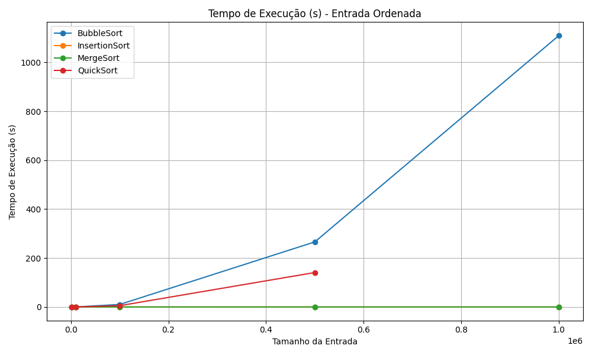
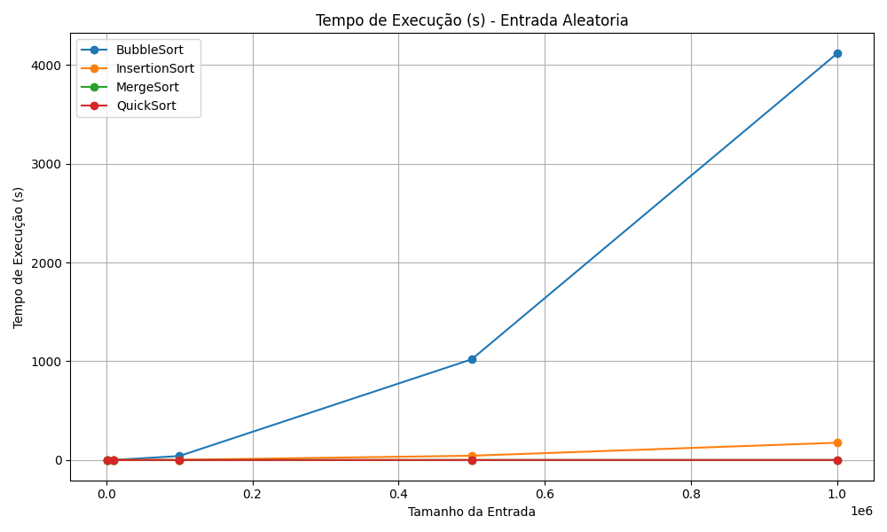
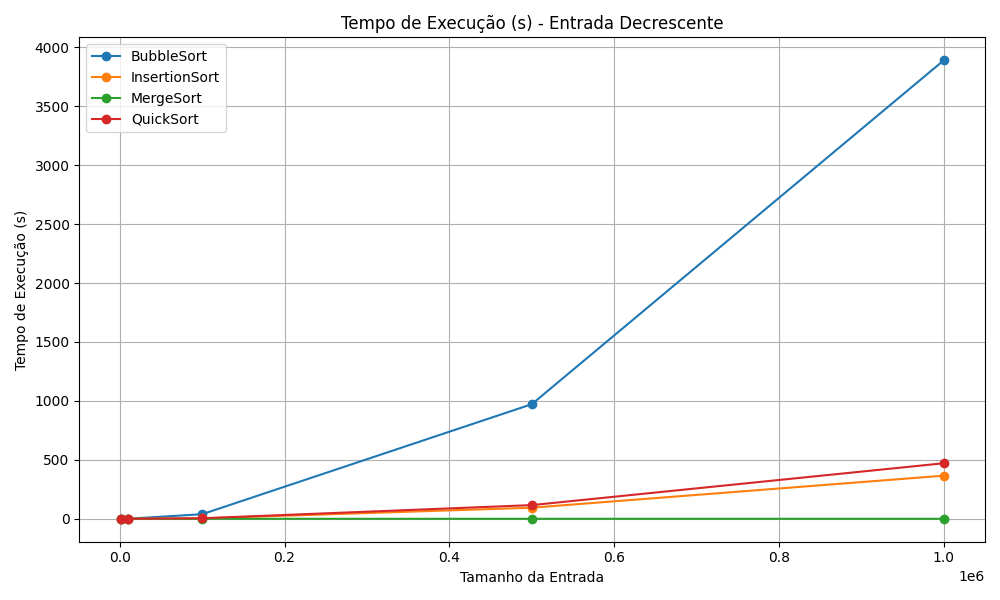
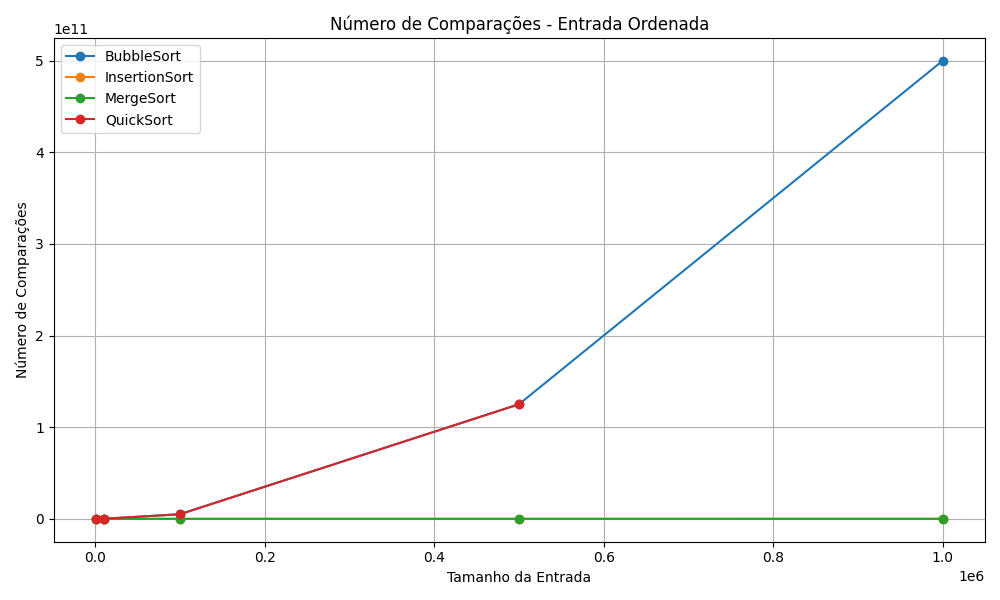
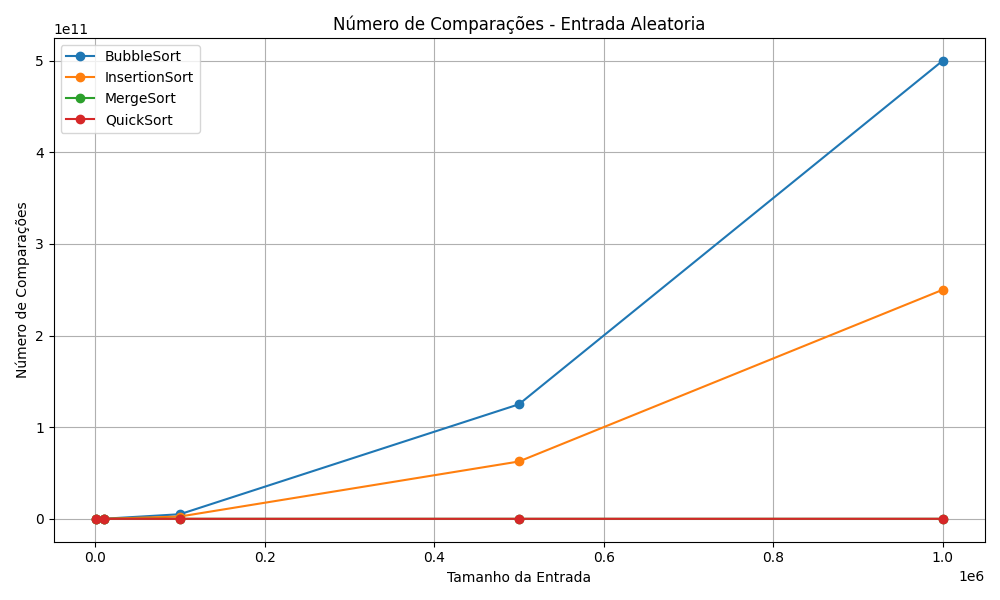
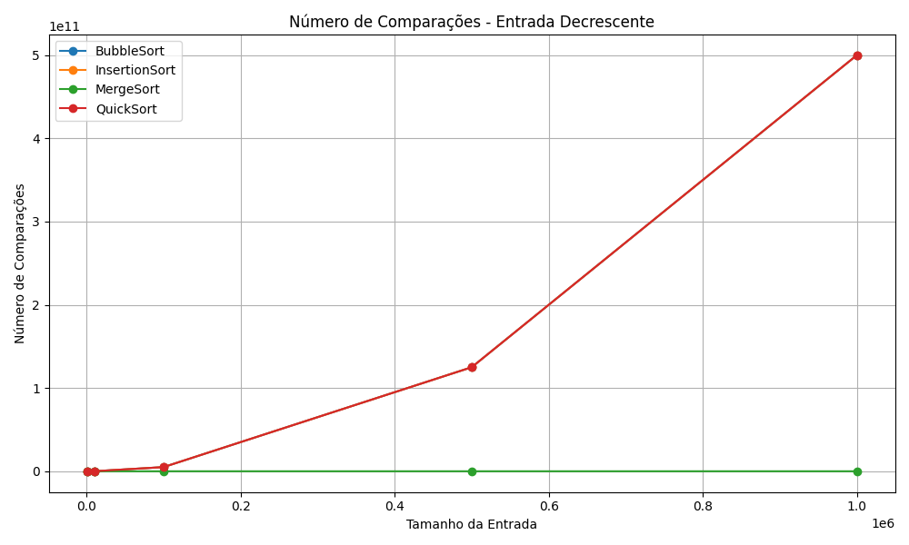

# Análise de Algoritmos de Ordenação

Trabalho do aluno Ryan Pimentel para a Disciplina de Análise de algoritmos no curso de ciência da computação da UFRR para a análise empírica dos algoritmos de ordenação **Bubble Sort**, **Insertion Sort**, **Merge Sort** e **Quick Sort**, com diferentes tamanhos de entrada e três tipos de arquivos: ordenado, aleatório e invertido (decrescente).

Abaixo estão os gráficos gerados a partir dos dados de três execuções experimentais, comparando o número de comparações e o tempo de execução em cada cenário.

---

## 📊 Tempo de Execução

### 1. Entradas Ordenadas

- **Insertion Sort** é extremamente eficiente com dados ordenados, com tempos próximos de zero.
- **Merge Sort** se mantém constante e eficiente.
- **Quick Sort** pode apresentar pior desempenho se não for randomizado.
- **Bubble Sort** continua sendo o mais ineficiente, mesmo com dados ordenados.

---

### 2. Entradas Aleatórias

- **Merge Sort** e **Quick Sort** mantêm ótima performance.
- **Bubble Sort** e **Insertion Sort** escalam mal com o aumento dos dados.

---

### 3. Entradas Decrescentes

- **Insertion Sort** e **Bubble Sort** atingem seus piores casos.
- **Quick Sort** também sofre se não houver randomização de pivôs.
- **Merge Sort** mantém sua eficiência independentemente da ordem.

---

## 📈 Número de Comparações

### 4. Entradas Ordenadas

- **Insertion Sort** apresenta número mínimo de comparações.
- **Bubble Sort** e **Quick Sort** realizam muitas comparações.
- **Merge Sort** permanece com um número constante de comparações.

---

### 5. Entradas Aleatórias

- **Merge Sort** e **Quick Sort** são claramente mais eficientes.
- **Insertion Sort** e **Bubble Sort** têm comportamento quadrático.

---

### 6. Entradas Decrescentes

- **Bubble Sort**, **Insertion Sort** e **Quick Sort** têm número explosivo de comparações.
- **Merge Sort** mantém número previsível e eficiente.

---

## 📁 Organização dos Arquivos

- Os gráficos estão na pasta `graficos/`
- O script de geração de gráficos está em `graficos_media.py`
- Os dados utilizados para gerar os gráficos estão em arquivos CSV

---

## 📌 Conclusões

- **Insertion Sort** é ideal apenas para listas pequenas e ordenadas.
- **Merge Sort** apresenta desempenho estável e previsível em qualquer cenário.
- **Quick Sort** é eficiente em média, mas pode ser prejudicado sem técnicas de otimização.
- **Bubble Sort** é o menos eficiente em todos os testes.

---

## 👨‍💻 Disciplina: Análise de Algoritmos
Trabalho prático com foco na comparação empírica de algoritmos de ordenação.
